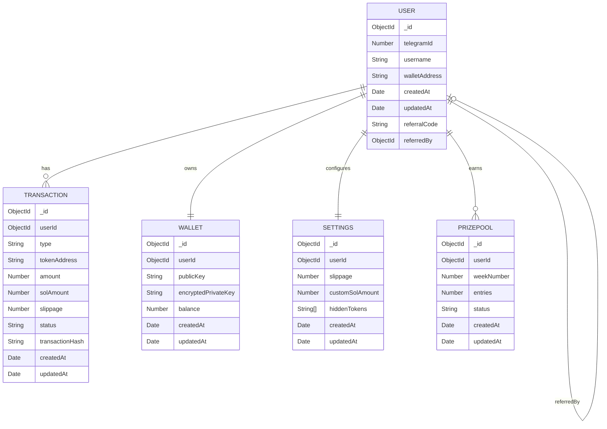

# Database Schema

This document details the MongoDB database schema for the Strike Bot, a Telegram trading bot for the Solana blockchain. It covers the schema design for all collections, relationships between models, indexes for performance, data validation rules, schema evolution strategy, and includes an entity-relationship (ER) diagram illustrating the connections between collections.

### Table of Contents

* Schema Design
* Relationships
* Indexes and Performance Optimizations
* Data Validation Rules and Constraints
* Schema Evolution Strategy
* Entity-Relationship Diagram

### Schema Design

The Strike Bot uses MongoDB as its primary database, with collections defined in the `domain/models/` directory. The following collections are implemented, based on the models and their usage in the codebase:

#### User Collection

Stores user profiles, including Telegram and wallet information.

```typescript
// domain/models/user.model.ts
{
  telegramId: number // Telegram user ID (primary identifier)
  username?: string // Telegram username (optional)
  firstName?: string // User's first name from Telegram
  lastName?: string // User's last name from Telegram
  isBlocked: boolean // Whether the user is blocked from using the bot
  isActive: boolean // Whether the user is active
  lastActive: Date // When the user was last active
  totalTransactionCount: number // Total number of transactions made
  totalTransactionVolume: number // Total volume of all transactions
  commissionId?: Types.ObjectId // Associated commission ID (ObjectId reference)
  referralId?: Types.ObjectId // Associated referral ID (ObjectId reference)
  walletId?: Types.ObjectId // Associated wallet ID (ObjectId reference)
  createdAt: Date // Timestamp when the user was created
  language?: string // User's preferred language
  metadata?: { // Additional user metadata
    [key: string]: any
  }
}
```

#### Transaction Collection

Records all trading activities, such as buy/sell orders.

```typescript
// domain/models/transaction.model.ts
{
  userId: Types.ObjectId // Reference to the User who made the transaction
  recipientTelegramId: number // Telegram ID of the user (keeping for backward compatibility)
  transactionId: string // Unique transaction identifier
  signature: string // Blockchain transaction signature
  type: 'buy' | 'sell' // Type of transaction
  tokenAddress: string // Address of the token being bought/sold
  tokenSymbol?: string // Symbol of the token (if available)
  tokenDecimals?: number // Decimals of the token (if available)
  amount: number // Amount of SOL involved in the transaction
  amountInToken?: number // Amount in token units (for the other side of the swap)
  valueUsd?: number // USD value of the transaction at execution time
  transactionFee: number // Total fee for the transaction
  feeBreakdown: TransactionFeeBreakdown // Detailed breakdown of the fee
  referrerId?: Types.ObjectId // User who referred the transaction maker (if any)
  indirectReferrerId?: Types.ObjectId // Indirect referrer (if any)
  status: 'pending' | 'executed' | 'completed' | 'failed' // Transaction status
  createdAt: Date // Timestamp when the transaction was created
  completedAt?: Date // Timestamp when the transaction was completed
  confirmationAttempts?: number // Number of confirmation attempts
  lastConfirmationAttempt?: Date // Timestamp of last confirmation attempt
  confirmationResult?: Record<string, any> // Result of confirmation attempt
  metadata?: Record<string, any> // Additional metadata about the transaction
}
```

#### Wallet Collection

Manages user wallet details and encrypted keys.

```typescript
// domain/models/wallet.model.ts
{
  userId: string // Telegram user ID
  address: string // Public wallet address
  encryptedPrivateKey: string // Encrypted private key
  createdAt: Date // Timestamp
}
```

#### Settings Collection

Stores user-specific trading preferences.

```typescript
// domain/models/settings.model.ts
{
  _id: ObjectId,                // Unique identifier
  userId: ObjectId,             // Reference to User
  slippage: Number,             // Default slippage percentage (default: 1)
  customSolAmount: Number,      // Default SOL amount for trades (optional)
  hiddenTokens: [String],       // List of hidden token addresses
  createdAt: Date,              // Settings creation timestamp
  updatedAt: Date,              // Last update timestamp
}
```

#### PrizePool Collection

Tracks prize pool entries and winners.

```typescript
// domain/models/prizepool.model.ts
interface PrizePoolEntry {
  userId: Types.ObjectId
  telegramId: number
  count: number
  transactionIds: string[]
  createdAt: Date
}

/**
 * Prize Pool Drawing Document Interface
 * Represents a prize pool drawing event
 */
interface PrizePoolDrawing {
  id: string
  date: Date
  winnerUserId: Types.ObjectId
  winnerTelegramId: number
  amount: number
  paymentTxHash?: string
}

/**
 * Prize Pool Document Interface
 * Represents the prize pool data including total amount,
 * entries, and drawings
 */
export interface PrizePoolDocument extends Document {
  totalAmount: number
  entries: PrizePoolEntry[]
  drawings: PrizePoolDrawing[]
  createdAt: Date
  lastUpdated: Date
}
```

### Relationships

The collections are interconnected to support the bot’s functionality:

* **User ↔ Wallet**: One-to-One
  * Each `User` has one `Wallet` (via `userId` in `Wallet`).
  * The `walletAddress` in `User` matches the `publicKey` in `Wallet`.
* **User ↔ Transaction**: One-to-Many
  * A `User` can have multiple `Transaction` records (via `userId` in `Transaction`).
* **User ↔ Settings**: One-to-One
  * Each `User` has one `Settings` document (via `userId` in `Settings`).
* **User ↔ PrizePool**: One-to-Many
  * A `User` can have multiple `PrizePool` entries for different weeks (via `userId` in `PrizePool`).
* **User ↔ User (Referral)**: Self-Referential
  * A `User` can be referred by another `User` (via `referredBy` referencing another `User._id`).

### Indexes and Performance Optimizations

Indexes are defined to optimize query performance, as configured in `database.config.ts`:

* **User Collection**:
  *   `telegramId`: Unique index for fast lookup by Telegram ID.

      ```typescript
      db.collection('users').createIndex({ telegramId: 1 }, { unique: true });
      ```
  *   `referralCode`: Unique index for referral lookups.

      ```typescript
      db.collection('users').createIndex({ referralCode: 1 }, { unique: true });
      ```
* **Transaction Collection**:
  *   `userId, createdAt`: Compound index for user-specific transaction history queries.

      ```typescript
      db.collection('transactions').createIndex({ userId: 1, createdAt: -1 });
      ```
  *   `status`: Index for filtering by transaction status.

      ```typescript
      db.collection('transactions').createIndex({ status: 1 });
      ```
* **Wallet Collection**:
  *   `userId`: Unique index for wallet lookups.

      ```typescript
      db.collection('wallets').createIndex({ userId: 1 }, { unique: true });
      ```
  *   `publicKey`: Unique index for wallet address validation.

      ```typescript
      db.collection('wallets').createIndex({ publicKey: 1 }, { unique: true });
      ```
* **Settings Collection**:
  *   `userId`: Unique index for settings retrieval.

      ```typescript
      db.collection('settings').createIndex({ userId: 1 }, { unique: true });
      ```
* **PrizePool Collection**:
  *   `userId, weekNumber`: Compound index for weekly entry queries.

      ```typescript
      db.collection('prizepools').createIndex({ userId: 1, weekNumber: 1 });
      ```
  *   `status`: Index for filtering active or won entries.

      ```typescript
      db.collection('prizepools').createIndex({ status: 1 });
      ```

**Database Configuration** (from `database.config.ts`):

```typescript
const dbConfig = {
  useNewUrlParser: true,
  useUnifiedTopology: true,
  serverSelectionTimeoutMS: 5000,
  socketTimeoutMS: 45000,
}
```

* Ensures reliable connections and efficient query execution.
* Indexes are applied during database initialization to optimize performance.

### Data Validation Rules and Constraints

Validation rules are enforced in the model definitions (`domain/models/*.model.ts`) and through MongoDB schema constraints:

* **User**:
  * `telegramId`: Required, unique, positive number.
  * `username`: Optional, string, max length 32 characters.
  * `walletAddress`: Required, valid Solana public key (44 characters, Base58).
  * `referralCode`: Required, unique, alphanumeric string (e.g., 8 characters).
  * `referredBy`: Optional, must reference a valid `User._id`.
* **Transaction**:
  * `userId`: Required, must reference a valid `User._id`.
  * `type`: Required, enum: `['buy', 'sell']`.
  * `tokenAddress`: Required, valid Solana token address.
  * `amount`, `solAmount`: Required, positive numbers.
  * `slippage`: Required, number between 0 and 100.
  * `status`: Required, enum: `['pending', 'completed', 'failed']`.
  * `transactionHash`: Optional, valid Solana transaction signature (Base58).
* **Wallet**:
  * `userId`: Required, unique, references `User._id`.
  * `publicKey`: Required, unique, valid Solana public key.
  * `encryptedPrivateKey`: Required, valid encrypted string (AES-encrypted).
  * `balance`: Required, non-negative number, default: 0.
* **Settings**:
  * `userId`: Required, unique, references `User._id`.
  * `slippage`: Optional, number between 0 and 100, default: 1.
  * `customSolAmount`: Optional, positive number.
  * `hiddenTokens`: Optional, array of valid Solana token addresses.
* **PrizePool**:
  * `userId`: Required, references `User._id`.
  * `weekNumber`: Required, positive integer (e.g., 2025-W01).
  * `entries`: Required, non-negative integer, default: 0.
  * `status`: Required, enum: `['active', 'won', 'expired']`.

**Validation Enforcement**:

* Mongoose schemas in `domain/models/*.model.ts` enforce types, required fields, and constraints.
* Pre-save hooks validate Solana addresses and encryption formats.
* Service layer (`services/`) adds business logic validation (e.g., sufficient balance).

### Schema Evolution Strategy

To support future changes and maintain backward compatibility, the following strategies are employed:

1. **Versioned Schemas**:
   * Each model includes a `schemaVersion` field (default: 1) to track changes.
   * Example: Add `schemaVersion: Number` to `User` for future migrations.
2. **Backward-Compatible Changes**:
   * New fields are added as optional to avoid breaking existing documents.
   * Example: Adding `language` to `Settings` with a default value.
3. **Migration Scripts**:
   * Scripts in `scripts/migrations/` update existing documents for major schema changes.
   * Example: Migrating `walletAddress` in `User` to a separate `Wallet` collection.
4. **Deprecation Process**:
   * Deprecated fields are marked with comments in models and retained for a grace period.
   * Example: Deprecating `username` in `User` if Telegram ID suffices.
5. **Data Validation on Read**:
   * Services (`settings.service.ts`, `wallet-service.ts`) handle missing or outdated fields gracefully.
   * Example: Default `slippage` to 1 if not set in `Settings`.
6. **Testing Migrations**:
   * Unit tests in `testing/` validate schema migrations before deployment.
   * Example: Test script to add `hiddenTokens` to all `Settings` documents.

### Entity-Relationship Diagram

The following Mermaid ER diagram illustrates the relationships between the `User`, `Transaction`, `Wallet`, `Settings`, and `PrizePool` collections:



#### Diagram Explanation

* **USER**: Central entity, linked to all other collections.
* **USER → TRANSACTION**: One user can have many transactions (e.g., buy/sell records).
* **USER → WALLET**: Each user has one wallet for Solana transactions.
* **USER → SETTINGS**: Each user has one settings document for trading preferences.
* **USER → PRIZEPOOL**: A user can have multiple prize pool entries for different weeks.
* **USER → USER**: Self-referential relationship for referrals (a user can be referred by another user).
