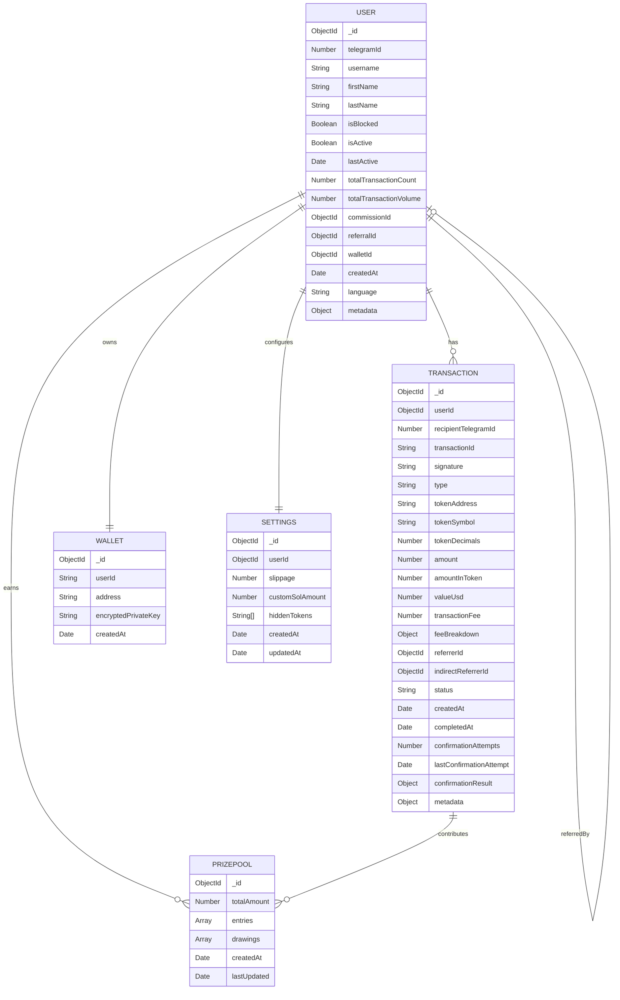

# Database Schema

This document details the MongoDB database schema for the Strike Bot, a Telegram trading bot for the Solana blockchain. It covers the schema design for all collections, relationships between models, indexes for performance, data validation rules, schema evolution strategy, and includes an entity-relationship (ER) diagram illustrating the connections between collections.

### Table of Contents

* Schema Design
* Relationships
* Indexes and Performance Optimizations
* Data Validation Rules and Constraints
* Schema Evolution Strategy
* Entity-Relationship Diagram

### Schema Design

The Strike Bot uses MongoDB as its primary database, with collections defined in the `domain/models/` directory. The following collections are implemented based on the provided models and their usage in the codebase.

#### User Collection

Stores user profiles, including Telegram details, wallet references, and referral information.

```typescript
// domain/models/user.model.ts
{
  _id: ObjectId,                   // Unique identifier
  telegramId: Number,              // Telegram user ID (unique)
  username: String,               // Telegram username (optional)
  firstName: String,              // User's first name from Telegram (optional)
  lastName: String,               // User's last name from Telegram (optional)
  isBlocked: Boolean,             // Whether the user is blocked from using the bot
  isActive: Boolean,              // Whether the user is active
  lastActive: Date,               // When the user was last active
  totalTransactionCount: Number,  // Total number of transactions made
  totalTransactionVolume: Number, // Total volume of all transactions
  commissionId: ObjectId,         // Associated commission ID (optional)
  referralId: ObjectId,           // Associated referral ID (optional)
  walletId: ObjectId,             // Associated wallet ID (optional)
  createdAt: Date,                // Timestamp when the user was created
  language: String,               // User's preferred language (optional)
  metadata: Object                // Additional user metadata (optional)
}
```

#### Transaction Collection

Records all trading activities, such as buy/sell orders, with detailed fee and referral information.

```typescript
// domain/models/transaction.model.ts
{
  _id: ObjectId,                   // Unique identifier
  userId: ObjectId,               // Reference to User who made the transaction
  recipientTelegramId: Number,     // Telegram ID of the user (for backward compatibility)
  transactionId: String,          // Unique transaction identifier
  signature: String,              // Blockchain transaction signature
  type: String,                   // 'buy' or 'sell'
  tokenAddress: String,           // Address of the token being bought/sold
  tokenSymbol: String,            // Symbol of the token (optional)
  tokenDecimals: Number,          // Decimals of the token (optional)
  amount: Number,                 // Amount of SOL involved
  amountInToken: Number,          // Amount in token units (optional)
  valueUsd: Number,               // USD value at execution time (optional)
  transactionFee: Number,         // Total fee for the transaction
  feeBreakdown: Object,           // Detailed breakdown of the fee
  referrerId: ObjectId,           // User who referred the transaction maker (optional)
  indirectReferrerId: ObjectId,   // Indirect referrer (optional)
  status: String,                 // 'pending', 'executed', 'completed', 'failed'
  createdAt: Date,                // Timestamp when the transaction was created
  completedAt: Date,              // Timestamp when the transaction was completed (optional)
  confirmationAttempts: Number,   // Number of confirmation attempts (optional)
  lastConfirmationAttempt: Date,  // Timestamp of last confirmation attempt (optional)
  confirmationResult: Object,     // Result of confirmation attempt (optional)
  metadata: Object                // Additional metadata (optional)
}
```

#### Wallet Collection

Manages user wallet details and encrypted keys.

```typescript
// domain/models/wallet.model.ts
{
  _id: ObjectId,                   // Unique identifier
  userId: String,                 // Telegram user ID
  address: String,                // Public wallet address
  encryptedPrivateKey: String,    // Encrypted private key
  createdAt: Date,                // Timestamp when the wallet was created
}
```

#### Settings Collection

Stores user-specific trading preferences.

```typescript
// domain/models/settings.model.ts
{
  _id: ObjectId,                   // Unique identifier
  userId: ObjectId,               // Reference to User
  slippage: Number,               // Default slippage percentage (default: 1)
  customSolAmount: Number,        // Default SOL amount for trades (optional)
  hiddenTokens: [String],         // List of hidden token addresses
  createdAt: Date,                // Settings creation timestamp
  updatedAt: Date,                // Last update timestamp
}
```

#### PrizePool Collection

Tracks prize pool entries and drawing events, including total amounts and winners.

```typescript
// domain/models/prizepool.model.ts
{
  _id: ObjectId,                   // Unique identifier
  totalAmount: Number,            // Total prize pool amount
  entries: [{
    userId: ObjectId,             // Reference to User
    telegramId: Number,           // Telegram user ID
    count: Number,               // Number of entries
    transactionIds: [String],    // Associated transaction IDs
    createdAt: Date              // Entry creation timestamp
  }],
  drawings: [{
    id: String,                   // Drawing identifier
    date: Date,                   // Drawing date
    winnerUserId: ObjectId,      // Winner's User ID
    winnerTelegramId: Number,    // Winner's Telegram ID
    amount: Number,              // Prize amount
    paymentTxHash: String        // Payment transaction hash (optional)
  }],
  createdAt: Date,                // Prize pool creation timestamp
  lastUpdated: Date               // Last update timestamp
}
```

### Relationships

The collections are interconnected to support the bot’s functionality:

* **User ↔ Wallet**: One-to-One
  * Each `User` has one `Wallet` (via `walletId` in `User` referencing `Wallet._id`).
  * The `userId` in `Wallet` corresponds to `User.telegramId`.
* **User ↔ Transaction**: One-to-Many
  * A `User` can have multiple `Transaction` records (via `userId` in `Transaction` referencing `User._id`).
* **User ↔ Settings**: One-to-One
  * Each `User` has one `Settings` document (via `userId` in `Settings` referencing `User._id`).
* **User ↔ PrizePool**: One-to-Many
  * A `User` can have multiple entries in the `PrizePool.entries` array (via `userId` referencing `User._id`).
  * A `User` can be a winner in `PrizePool.drawings` (via `winnerUserId` referencing `User._id`).
* **User ↔ User (Referral)**: Self-Referential
  * A `User` can be referred by another `User` (via `referralId` or `referredBy` referencing another `User._id`).
* **Transaction ↔ PrizePool**: Many-to-Many
  * `Transaction` records contribute to `PrizePool.entries` via `transactionIds` in the `entries` array.

### Indexes and Performance Optimizations

Indexes are defined to optimize query performance, as configured in `database.config.ts`:

* **User Collection**:
  *   `telegramId`: Unique index for fast lookup by Telegram ID.

      ```typescript
      db.collection('users').createIndex({ telegramId: 1 }, { unique: true });
      ```
  *   `referralId`: Index for referral lookups.

      ```typescript
      db.collection('users').createIndex({ referralId: 1 });
      ```
* **Transaction Collection**:
  *   `userId, createdAt`: Compound index for user-specific transaction history queries.

      ```typescript
      db.collection('transactions').createIndex({ userId: 1, createdAt: -1 });
      ```
  *   `status`: Index for filtering by transaction status.

      ```typescript
      db.collection('transactions').createIndex({ status: 1 });
      ```
  *   `transactionId`: Unique index for transaction lookups.

      ```typescript
      db.collection('transactions').createIndex({ transactionId: 1 }, { unique: true });
      ```
* **Wallet Collection**:
  *   `userId`: Unique index for wallet lookups.

      ```typescript
      db.collection('wallets').createIndex({ userId: 1 }, { unique: true });
      ```
  *   `address`: Unique index for wallet address validation.

      ```typescript
      db.collection('wallets').createIndex({ address: 1 }, { unique: true });
      ```
* **Settings Collection**:
  *   `userId`: Unique index for settings retrieval.

      ```typescript
      db.collection('settings').createIndex({ userId: 1 }, { unique: true });
      ```
* **PrizePool Collection**:
  *   `entries.userId`: Index for querying user entries.

      ```typescript
      db.collection('prizepools').createIndex({ "entries.userId": 1 });
      ```
  *   `drawings.winnerUserId`: Index for winner lookups.

      ```typescript
      db.collection('prizepools').createIndex({ "drawings.winnerUserId": 1 });
      ```

**Database Configuration** (from `database.config.ts`):

```typescript
const dbConfig = {
  useNewUrlParser: true,
  useUnifiedTopology: true,
  serverSelectionTimeoutMS: 5000,
  socketTimeoutMS: 45000,
}
```

* Ensures reliable connections and efficient query execution.
* Indexes are applied during database initialization to optimize performance.

### Data Validation Rules and Constraints

Validation rules are enforced in the model definitions (`domain/models/*.model.ts`) and through MongoDB schema constraints:

* **User**:
  * `telegramId`: Required, unique, positive number.
  * `username`, `firstName`, `lastName`: Optional, string, max length 32 characters.
  * `isBlocked`, `isActive`: Required, boolean, default: `false` and `true`.
  * `lastActive`, `createdAt`: Required, valid Date.
  * `totalTransactionCount`, `totalTransactionVolume`: Required, non-negative numbers, default: 0.
  * `commissionId`, `referralId`, `walletId`: Optional, must reference valid `ObjectId`.
  * `language`: Optional, string (e.g., ISO 639-1 code).
  * `metadata`: Optional, object with arbitrary key-value pairs.
* **Transaction**:
  * `userId`: Required, must reference a valid `User._id`.
  * `recipientTelegramId`: Required, positive number.
  * `transactionId`, `signature`: Required, unique, valid strings.
  * `type`: Required, enum: `['buy', 'sell']`.
  * `tokenAddress`: Required, valid Solana token address (44 characters, Base58).
  * `tokenSymbol`: Optional, string, max length 10 characters.
  * `tokenDecimals`: Optional, non-negative integer.
  * `amount`: Required, positive number.
  * `amountInToken`, `valueUsd`: Optional, positive numbers.
  * `transactionFee`: Required, non-negative number.
  * `feeBreakdown`: Required, object with fee details.
  * `referrerId`, `indirectReferrerId`: Optional, must reference valid `User._id`.
  * `status`: Required, enum: `['pending', 'executed', 'completed', 'failed']`.
  * `createdAt`: Required, valid Date.
  * `completedAt`, `lastConfirmationAttempt`: Optional, valid Date.
  * `confirmationAttempts`: Optional, non-negative integer.
  * `confirmationResult`, `metadata`: Optional, objects.
* **Wallet**:
  * `userId`: Required, unique, string (Telegram ID).
  * `address`: Required, unique, valid Solana public key (44 characters, Base58).
  * `encryptedPrivateKey`: Required, valid AES-encrypted string.
  * `createdAt`: Required, valid Date.
* **Settings**:
  * `userId`: Required, unique, references `User._id`.
  * `slippage`: Optional, number between 0 and 100, default: 1.
  * `customSolAmount`: Optional, positive number.
  * `hiddenTokens`: Optional, array of valid Solana token addresses.
  * `createdAt`, `updatedAt`: Required, valid Date.
* **PrizePool**:
  * `totalAmount`: Required, non-negative number.
  * `entries.userId`: Required, references `User._id`.
  * `entries.telegramId`: Required, positive number.
  * `entries.count`: Required, non-negative integer.
  * `entries.transactionIds`: Required, array of valid `Transaction.transactionId`.
  * `entries.createdAt`: Required, valid Date.
  * `drawings.id`: Required, unique string.
  * `drawings.date`: Required, valid Date.
  * `drawings.winnerUserId`: Required, references `User._id`.
  * `drawings.winnerTelegramId`: Required, positive number.
  * `drawings.amount`: Required, positive number.
  * `drawings.paymentTxHash`: Optional, valid Solana transaction signature.
  * `createdAt`, `lastUpdated`: Required, valid Date.

**Validation Enforcement**:

* Mongoose schemas enforce types, required fields, and constraints.
* Pre-save hooks validate Solana addresses, encryption formats, and transaction IDs.
* Service layer (`services/`) adds business logic validation (e.g., sufficient balance).

### Schema Evolution Strategy

To support future changes and maintain backward compatibility, the following strategies are employed:

1. **Versioned Schemas**:
   * Each model includes a `schemaVersion` field (default: 1) to track changes.
   * Example: Add `schemaVersion: Number` to `User` for future migrations.
2. **Backward-Compatible Changes**:
   * New fields are added as optional to avoid breaking existing documents.
   * Example: Adding `theme` to `Settings` with a default value.
3. **Migration Scripts**:
   * Scripts in `scripts/migrations/` update existing documents for major schema changes.
   * Example: Migrating `recipientTelegramId` in `Transaction` to rely solely on `userId`.
4. **Deprecation Process**:
   * Deprecated fields (e.g., `recipientTelegramId` in `Transaction`) are marked in models and retained for a grace period.
   * Example: Deprecating `username` in `User` if `telegramId` suffices.
5. **Data Validation on Read**:
   * Services (`settings.service.ts`, `wallet-service.ts`) handle missing or outdated fields gracefully.
   * Example: Default `slippage` to 1 if not set in `Settings`.
6. **Testing Migrations**:
   * Unit tests in `testing/` validate schema migrations before deployment.
   * Example: Test script to populate `hiddenTokens` in all `Settings` documents.

### Entity-Relationship Diagram

The following Mermaid ER diagram illustrates the relationships between the `User`, `Transaction`, `Wallet`, `Settings`, and `PrizePool` collections:



#### Diagram Explanation

* **USER**: Central entity, linked to all other collections.
* **USER → TRANSACTION**: One user can have many transactions (e.g., buy/sell records).
* **USER → WALLET**: Each user has one wallet (via `walletId`).
* **USER → SETTINGS**: Each user has one settings document.
* **USER → PRIZEPOOL**: A user can have multiple entries in `PrizePool.entries` and be a winner in `PrizePool.drawings`.
* **USER → USER**: Self-referential for referrals (via `referralId` or `referredBy`).
* **TRANSACTION → PRIZEPOOL**: Transactions contribute to prize pool entries via `transactionIds`.
