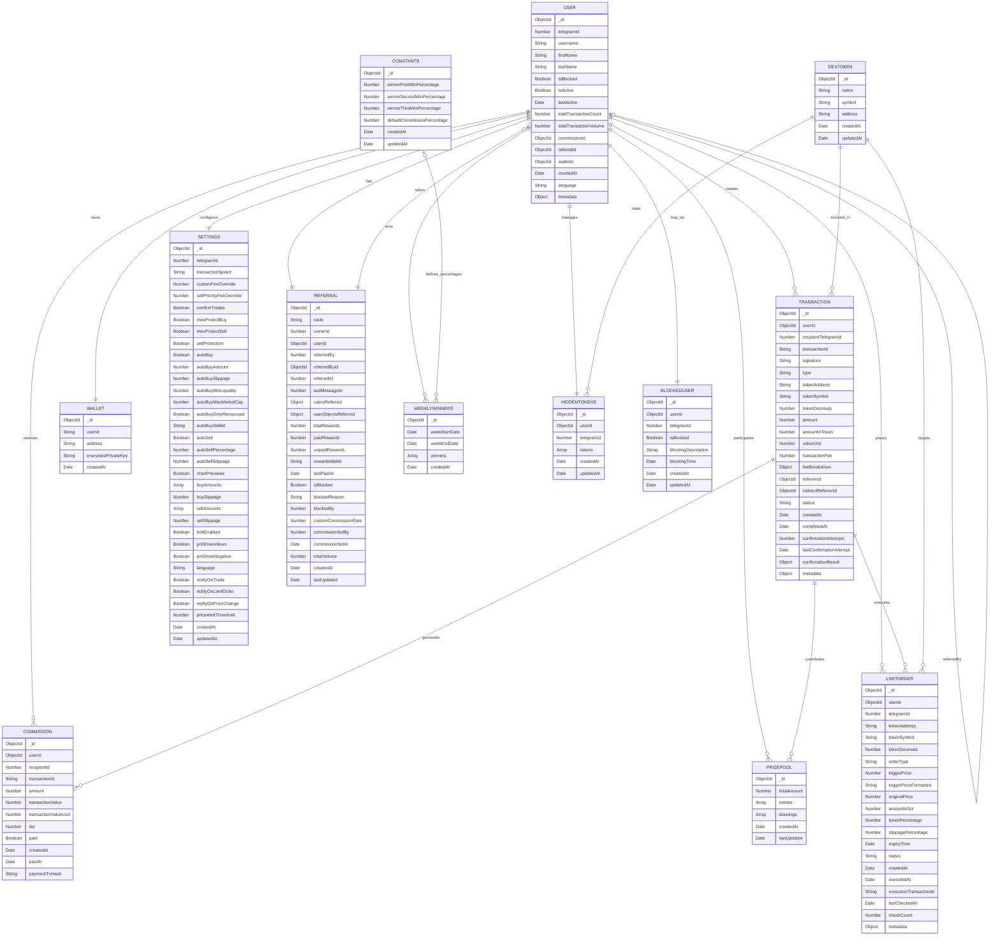

# Database Schema

This document details the MongoDB database schema for the Telegram trading bot, a platform that facilitates cryptocurrency trading on the Solana blockchain. It covers the schema design for all collections, relationships between models, indexes for performance optimization, data validation rules, schema evolution strategy, and includes an entity-relationship (ER) diagram illustrating the connections between collections.

### Table of Contents

* Schema Design
* Relationships
* Indexes and Performance Optimizations
* Data Validation Rules and Constraints
* Schema Evolution Strategy
* Entity-Relationship Diagram

### Schema Design

The trading bot uses MongoDB as its primary database, with collections defined through Mongoose schemas. The following collections form the core of the application's data structure.

#### User Collection

Stores user profiles, including Telegram details, wallet references, and tracking metrics.

```typescript
// User model structure
{
  _id: ObjectId,                       // Unique identifier
  telegramId: Number,                  // Telegram user ID (unique)
  username: String,                    // Telegram username (optional)
  firstName: String,                   // User's first name (optional)
  lastName: String,                    // User's last name (optional)
  isBlocked: Boolean,                  // Whether user is blocked from using the bot
  isActive: Boolean,                   // Whether user is active
  lastActive: Date,                    // When user was last active
  totalTransactionCount: Number,       // Total number of transactions made
  totalTransactionVolume: Number,      // Total volume of all transactions
  commissionId: ObjectId,              // Associated commission ID (optional)
  referralId: ObjectId,                // Associated referral ID (optional)
  walletId: ObjectId,                  // Associated wallet ID (optional)
  createdAt: Date,                     // Timestamp when user was created
  language: String,                    // User's preferred language (default: 'en')
  metadata: Object                     // Additional user metadata (optional)
}
```

#### Wallet Collection

Manages user wallet details and encrypted keys.

```typescript
// Wallet model structure
{
  _id: ObjectId,                       // Unique identifier
  userId: String,                      // Telegram user ID
  address: String,                     // Public wallet address
  encryptedPrivateKey: String,         // Encrypted private key
  createdAt: Date                      // Timestamp when wallet was created
}
```

#### Transaction Collection

Records all trading activities, with detailed fee breakdown and referral information.

```typescript
// Transaction model structure
{
  _id: ObjectId,                       // Unique identifier
  userId: ObjectId,                    // Reference to User who made the transaction
  recipientTelegramId: Number,         // Telegram ID of the user
  transactionId: String,               // Unique transaction identifier
  signature: String,                   // Blockchain transaction signature
  type: String,                        // 'buy' or 'sell'
  tokenAddress: String,                // Address of the token being bought/sold
  tokenSymbol: String,                 // Symbol of the token (optional)
  tokenDecimals: Number,               // Decimals of the token (optional)
  amount: Number,                      // Amount of SOL involved
  amountInToken: Number,               // Amount in token units (optional)
  valueUsd: Number,                    // USD value at execution time (optional)
  transactionFee: Number,              // Total fee for the transaction
  feeBreakdown: {                      // Detailed breakdown of the fee
    platformFee: Number,               // Total platform fee (1% of transaction)
    prizePoolContribution: Number,     // Amount for prize pool (10% of platform fee)
    directReferralCommission: Number,  // Commission for direct referrer (50% of remaining fee)
    indirectReferralCommission: Number,// Commission for indirect referrer (10% of remaining fee)
    platformRevenue: Number            // Remaining amount for platform
  },
  referrerId: ObjectId,                // User who referred the transaction maker (optional)
  indirectReferrerId: ObjectId,        // Indirect referrer (optional)
  status: String,                      // 'pending', 'executed', 'completed', 'failed'
  createdAt: Date,                     // Timestamp when transaction was created
  completedAt: Date,                   // Timestamp when transaction was completed (optional)
  confirmationAttempts: Number,        // Number of confirmation attempts
  lastConfirmationAttempt: Date,       // Timestamp of last confirmation attempt
  confirmationResult: Object,          // Result of confirmation attempt
  metadata: Object                     // Additional metadata about the transaction
}
```

#### Commission Collection

Tracks commission payments to referrers based on transaction activity.

```typescript
// Commission model structure
{
  _id: ObjectId,                       // Unique identifier
  userId: ObjectId,                    // Reference to User model (recipient)
  recipientId: Number,                 // Telegram ID of the recipient
  transactionId: String,               // Transaction identifier
  amount: Number,                      // Commission amount in SOL
  transactionValue: Number,            // Value of the original transaction in SOL
  transactionValueUsd: Number,         // USD value of the transaction
  tier: Number,                        // Only 2 tiers: 1=direct, 2=indirect
  paid: Boolean,                       // Whether the commission has been paid
  createdAt: Date,                     // Commission creation timestamp
  paidAt: Date,                        // Timestamp when commission was paid (optional)
  paymentTxHash: String                // Blockchain transaction hash for payment (optional)
}
```

#### Referral Collection

Manages the referral system, tracking referral codes, rewards, and relationships.

```typescript
// Referral model structure
{
  _id: ObjectId,                       // Unique identifier
  code: String,                        // Unique referral code
  ownerId: Number,                     // Telegram ID of the owner
  userId: ObjectId,                    // Reference to User model
  referredBy: Number,                  // Telegram ID of user who referred this user (optional)
  referredById: ObjectId,              // Reference to User who referred this user (optional)
  referredId: Number,                  // Legacy field for compatibility
  lastMessageId: Number,               // Last message ID (optional)
  usersReferred: {                     // Users referred by this user
    direct: [Number],                  // Tier 1 referrals (directly referred)
    indirect: [Number]                 // Tier 2 referrals (referred by direct referrals)
  },
  userObjectsReferred: {               // References to User objects
    direct: [ObjectId],                // Direct referrals
    indirect: [ObjectId]               // Indirect referrals
  },
  totalRewards: Number,                // Total rewards earned
  paidRewards: Number,                 // Rewards that have been paid
  unpaidRewards: Number,               // Rewards that are unpaid
  rewardsWallet: String,               // Wallet address for rewards (optional)
  lastPaidAt: Date,                    // Timestamp of last payment (optional)
  isBlocked: Boolean,                  // Whether referral is blocked
  blockedReason: String,               // Reason for blocking (optional)
  blockedBy: Number,                   // Who blocked the referral (optional)
  customCommissionRate: Number,        // Custom commission rate (optional)
  commissionSetBy: Number,             // Who set the commission rate (optional)
  commissionSetAt: Date,               // When commission rate was set (optional)
  totalVolume: Number,                 // Total trading volume referred
  createdAt: Date,                     // Referral creation timestamp
  lastUpdated: Date                    // Last update timestamp
}
```

#### WeeklyWinners Collection

Tracks the weekly prize winners and their winnings.

```typescript
// WeeklyWinners model structure
{
  _id: ObjectId,                       // Unique identifier
  weekStartDate: Date,                 // Start date of the week
  weekEndDate: Date,                   // End date of the week
  winners: [{                          // Array of winners
    position: Number,                  // Winner's position (1st, 2nd, or 3rd)
    userId: ObjectId,                  // Reference to the User model
    winningAmount: Number,             // Amount won by the user
    winningPercentage: Number          // Percentage of the total prize pool won
  }],
  createdAt: Date                      // Timestamp when record was created
}
```

#### PrizePool Collection

Tracks prize pool entries and drawing events.

```typescript
// PrizePool model structure
{
  _id: ObjectId,                       // Unique identifier
  totalAmount: Number,                 // Total prize pool amount
  entries: [{                          // Array of entries
    userId: ObjectId,                  // Reference to User
    telegramId: Number,                // Telegram ID
    count: Number,                     // Number of entries
    transactionIds: [String],          // Associated transaction IDs
    createdAt: Date                    // Entry creation timestamp
  }],
  drawings: [{                         // Array of drawings
    id: String,                        // Drawing identifier
    date: Date,                        // Drawing date
    winnerUserId: ObjectId,            // Winner's User ID
    winnerTelegramId: Number,          // Winner's Telegram ID
    amount: Number,                    // Prize amount
    paymentTxHash: String              // Payment transaction hash (optional)
  }],
  createdAt: Date,                     // Prize pool creation timestamp
  lastUpdated: Date                    // Last update timestamp
}
```

#### Settings Collection

Stores user-specific trading preferences and configurations.

```typescript
// Settings model structure
{
  _id: ObjectId,                       // Unique identifier
  telegramId: Number,                  // Telegram user ID (unique)
  
  // Transaction settings
  transactionSpeed: String,            // 'normal', 'fast', 'turbo', 'custom'
  customFeeOverride: Number,           // Custom fee override (optional)
  sellPriorityFeeOverride: Number,     // Sell priority fee override (optional)
  
  // Trade confirmation settings
  confirmTrades: Boolean,              // Whether to confirm trades
  
  // Protection features
  mevProtectBuy: Boolean,              // MEV protection for buys
  mevProtectSell: Boolean,             // MEV protection for sells
  sellProtection: Boolean,             // Sell protection feature
  
  // Automation settings
  autoBuy: Boolean,                    // Auto-buy feature toggle
  autoBuyAmount: Number,               // Amount for auto-buys (optional)
  autoBuySlippage: Number,             // Slippage for auto-buys (optional)
  autoBuyMinLiquidity: Number,         // Minimum liquidity for auto-buys (optional)
  autoBuyMaxMarketCap: Number,         // Maximum market cap for auto-buys (optional)
  autoBuyOnlyRenounced: Boolean,       // Only buy renounced tokens
  autoBuyWallet: String,               // Wallet for auto-buys (optional)
  
  autoSell: Boolean,                   // Auto-sell feature toggle
  autoSellPercentage: Number,          // Percentage for auto-sells (optional)
  autoSellSlippage: Number,            // Slippage for auto-sells (optional)
  
  // UI preferences
  chartPreviews: Boolean,              // Show chart previews
  
  // Buy/Sell settings
  buyAmounts: [Number],                // Array of predefined buy amounts
  buySlippage: Number,                 // Default buy slippage
  
  sellAmounts: [Number],               // Array of predefined sell percentages
  sellSlippage: Number,                // Default sell slippage
  
  // Feature toggles
  boltEnabled: Boolean,                // Bolt feature toggle
  
  // PNL Card settings
  pnlShowValues: Boolean,              // Show PNL values
  pnlShowNegative: Boolean,            // Show negative PNL
  
  // Localization
  language: String,                    // User's language preference
  
  // Notification settings
  notifyOnTrade: Boolean,              // Notify on trade completion
  notifyOnLimitOrder: Boolean,         // Notify on limit order execution
  notifyOnPriceChange: Boolean,        // Notify on price changes
  priceAlertThreshold: Number,         // Price alert threshold percentage
  
  createdAt: Date,                     // Settings creation timestamp
  updatedAt: Date                      // Last update timestamp
}
```

#### LimitOrder Collection

Manages limit orders for buying and selling tokens.

```typescript
// LimitOrder model structure
{
  _id: ObjectId,                       // Unique identifier
  userId: ObjectId,                    // Reference to the user who created the order
  telegramId: Number,                  // Telegram ID for quick access
  
  // Token information
  tokenAddress: String,                // Token contract address
  tokenSymbol: String,                 // Token symbol
  tokenDecimals: Number,               // Token decimals
  
  // Order parameters
  orderType: String,                   // 'buy' or 'sell'
  triggerPrice: Number,                // Target price in USD
  triggerPriceFormatted: String,       // Human-readable price
  originalPrice: Number,               // Price at creation time
  
  // Order amounts
  amountInSol: Number,                 // For buy orders: amount of SOL to spend
  tokenPercentage: Number,             // For sell orders: percentage of tokens to sell
  
  // Execution parameters
  slippagePercentage: Number,          // Slippage tolerance
  expiryTime: Date,                    // Expiration timestamp
  
  // Status information
  status: String,                      // 'active', 'executed', 'expired', 'cancelled', 'failed'
  createdAt: Date,                     // Creation timestamp
  executedAt: Date,                    // Execution timestamp (optional)
  executionTransactionId: String,      // Reference to transaction (optional)
  
  // Tracking fields
  lastCheckedAt: Date,                 // Last price check time (optional)
  checkCount: Number,                  // Number of price checks
  
  // Additional data
  metadata: Object                     // Additional metadata (optional)
}
```

#### HiddenTokens Collection

Tracks tokens that users have chosen to hide from their view.

```typescript
// HiddenTokens model structure
{
  _id: ObjectId,                       // Unique identifier
  userId: ObjectId,                    // Reference to User model
  telegramId: Number,                  // Telegram ID of the user
  tokens: [{                           // Array of hidden tokens
    symbol: String,                    // Token symbol
    address: String,                   // Token address
    hiddenAt: Date                     // When the token was hidden
  }],
  createdAt: Date,                     // Creation timestamp
  updatedAt: Date                      // Last update timestamp
}
```

#### BlockedUser Collection

Manages users who have been blocked from using the platform.

```typescript
// BlockedUser model structure
{
  _id: ObjectId,                       // Unique identifier
  userId: ObjectId,                    // Reference to the User model
  telegramId: Number,                  // Telegram ID of the user
  isBlocked: Boolean,                  // Whether the user is blocked
  blockingDescription: String,         // Reason for blocking (optional)
  blockingTime: Date,                  // When the user was blocked
  createdAt: Date,                     // Creation timestamp
  updatedAt: Date                      // Last update timestamp
}
```

#### DexToken Collection

Stores information about tokens available on decentralized exchanges.

```typescript
// DexToken model structure
{
  _id: ObjectId,                       // Unique identifier
  name: String,                        // Token name
  symbol: String,                      // Token symbol (can be null)
  address: String,                     // Token address/contract
  createdAt: Date,                     // Creation timestamp
  updatedAt: Date                      // Last update timestamp
}
```

#### Constants Collection

Stores configurable constants for the application.

```typescript
// Constants model structure
{
  _id: ObjectId,                       // Unique identifier
  winnerFirstWinPercentage: Number,    // Percentage for the 1st winner
  winnerSecondWinPercentage: Number,   // Percentage for the 2nd winner
  winnerThirdWinPercentage: Number,    // Percentage for the 3rd winner
  defaultCommissionPercentage: Number, // Default commission percentage
  createdAt: Date,                     // Creation timestamp
  updatedAt: Date                      // Last update timestamp
}
```

### Relationships

The database schema incorporates various relationships between collections to support the trading bot's functionality:

#### Primary Relationships

1. **User → Wallet** (One-to-One)
   * Each `User` has one `Wallet` (via `walletId` in `User` referencing `Wallet._id`)
   * The `userId` in `Wallet` corresponds to `User.telegramId`
2. **User → Settings** (One-to-One)
   * Each `User` has one `Settings` document (via `telegramId` in `Settings` matching `User.telegramId`)
3. **User → Transaction** (One-to-Many)
   * A `User` can have multiple `Transaction` records (via `userId` in `Transaction` referencing `User._id`)
4. **User → Commission** (One-to-Many)
   * A `User` can receive multiple `Commission` payments (via `userId` in `Commission` referencing `User._id`)
5. **User → Referral** (One-to-One)
   * Each `User` has one `Referral` document (via `userId` in `Referral` referencing `User._id`)
6. **User → LimitOrder** (One-to-Many)
   * A `User` can have multiple `LimitOrder` records (via `userId` in `LimitOrder` referencing `User._id`)
7. **User → HiddenTokens** (One-to-One)
   * Each `User` has one `HiddenTokens` document (via `userId` in `HiddenTokens` referencing `User._id`)
8. **User → BlockedUser** (One-to-One)
   * A `User` can have one `BlockedUser` record (via `userId` in `BlockedUser` referencing `User._id`)

#### Referral Relationships

1. **User → User** (Referral Hierarchy)
   * A `User` can be referred by another `User`
   * This is tracked via the `Referral` model which maintains both direct and indirect referrals
2. **Transaction → Commission** (One-to-Many)
   * A `Transaction` can generate multiple `Commission` records (one for direct referrer, one for indirect)
   * Linked via `transactionId` in `Commission` matching `Transaction.transactionId`
3. **Transaction → PrizePool** (Many-to-Many)
   * `Transaction` records contribute to `PrizePool.entries` via `transactionIds` in the entries array

#### Prize Pool Relationships

1. **User → PrizePool** (Many-to-Many)
   * A `User` can have multiple entries in the `PrizePool.entries` array
   * A `User` can be a winner in `PrizePool.drawings`
2. **User → WeeklyWinners** (Many-to-Many)
   * A `User` can be in the `winners` array of `WeeklyWinners` documents

### Indexes and Performance Optimizations

To ensure optimal performance, the schema defines numerous indexes across collections:

#### User Collection

```typescript
UserSchema.index({ telegramId: 1 }, { unique: true })
UserSchema.index({ username: 1 })
UserSchema.index({ referralId: 1 })
UserSchema.index({ isActive: 1 })
UserSchema.index({ lastActive: 1 })
```

#### Transaction Collection

```typescript
TransactionSchema.index({ userId: 1 })
TransactionSchema.index({ recipientTelegramId: 1 })
TransactionSchema.index({ transactionId: 1 }, { unique: true })
TransactionSchema.index({ signature: 1 }, { unique: true })
TransactionSchema.index({ type: 1 })
TransactionSchema.index({ tokenAddress: 1 })
TransactionSchema.index({ createdAt: 1 })
TransactionSchema.index({ status: 1 })
TransactionSchema.index({ referrerId: 1 })
TransactionSchema.index({ indirectReferrerId: 1 })
TransactionSchema.index({ status: 1, lastConfirmationAttempt: 1 })
TransactionSchema.index({ confirmationAttempts: 1 })
```

#### Wallet Collection

```typescript
WalletSchema.index({ userId: 1 }, { unique: true })
```

#### Commission Collection

```typescript
CommissionSchema.index({ userId: 1 })
CommissionSchema.index({ recipientId: 1 })
CommissionSchema.index({ transactionId: 1 })
CommissionSchema.index({ paid: 1 })
CommissionSchema.index({ createdAt: 1 })
CommissionSchema.index({ transactionId: 1, recipientId: 1, tier: 1 }, { unique: true })
```

#### Referral Collection

```typescript
ReferralSchema.index({ userId: 1 }, { unique: true })
ReferralSchema.index({ ownerId: 1 }, { unique: true })
ReferralSchema.index({ code: 1 }, { unique: true })
ReferralSchema.index({ referredBy: 1 })
ReferralSchema.index({ referredById: 1 })
```

#### WeeklyWinners Collection

```typescript
WeeklyWinnersSchema.index({ weekStartDate: 1, weekEndDate: 1 }, { unique: true })
WeeklyWinnersSchema.index({ 'winners.userId': 1 })
```

#### PrizePool Collection

```typescript
PrizePoolSchema.index({ 'entries.userId': 1 })
PrizePoolSchema.index({ 'entries.telegramId': 1 })
PrizePoolSchema.index({ 'drawings.winnerUserId': 1 })
PrizePoolSchema.index({ 'drawings.date': 1 })
```

#### Settings Collection

```typescript
SettingsSchema.index({ telegramId: 1 }, { unique: true, index: true })
```

#### LimitOrder Collection

```typescript
LimitOrderSchema.index({ userId: 1 })
LimitOrderSchema.index({ telegramId: 1 })
LimitOrderSchema.index({ tokenAddress: 1 })
LimitOrderSchema.index({ status: 1 })
LimitOrderSchema.index({ expiryTime: 1 })
LimitOrderSchema.index({ orderType: 1 })
LimitOrderSchema.index({ triggerPrice: 1 })
LimitOrderSchema.index({ status: 1, expiryTime: 1 })
LimitOrderSchema.index({ tokenAddress: 1, status: 1 })
```

#### HiddenTokens Collection

```typescript
HiddenTokensSchema.index({ userId: 1 }, { unique: true })
HiddenTokensSchema.index({ telegramId: 1 }, { unique: true })
HiddenTokensSchema.index({ 'tokens.address': 1 })
```

#### BlockedUser Collection

```typescript
BlockedUserSchema.index({ userId: 1 }, { unique: true })
BlockedUserSchema.index({ telegramId: 1 })
BlockedUserSchema.index({ isBlocked: 1 })
BlockedUserSchema.index({ blockingTime: 1 })
```

#### DexToken Collection

```typescript
DexTokenSchema.index({ address: 1 }, { unique: true })
DexTokenSchema.index({ name: 1 })
DexTokenSchema.index({ symbol: 1 })
DexTokenSchema.index({ createdAt: -1 })
```

These indexes significantly improve query performance for common operations:

* User lookup by telegramId
* Transaction history queries
* Referral relationship traversal
* Prize pool entry and drawing queries

### Data Validation Rules and Constraints

The models enforce various validation rules to maintain data integrity:

#### User Validation

* `telegramId`: Required, unique, must be a positive integer
* `isBlocked`, `isActive`: Boolean values with defaults
* `totalTransactionCount`, `totalTransactionVolume`: Non-negative numbers with defaults

#### Transaction Validation

* `userId`: Required, must reference a valid User
* `transactionId`, `signature`: Required, unique strings
* `type`: Must be either 'buy' or 'sell'
* `amount`: Must be a positive number
* `status`: Must be one of 'pending', 'executed', 'completed', 'failed'
* `feeBreakdown`: Required object with specific fee components

#### Wallet Validation

* `userId`: Required, unique string
* `address`: Required, unique string (valid Solana address)
* `encryptedPrivateKey`: Required string

#### Settings Validation

```typescript
SettingsSchema.pre('save', function (next) {
  // Validate conditional fields
  if (this.transactionSpeed === 'custom' && this.customFeeOverride === undefined) {
    return next(new Error('Custom fee override is required when transaction speed is set to custom'))
  }
  next()
})

SettingsSchema.methods.validateSettings = function (): boolean {
  // Uses Zod schema for validation
  try {
    SettingsValidationSchema.parse(this.toObject())
    return true
  } catch (error) {
    return false
  }
}
```

Key validations include:

* `buyAmounts`: Array of positive numbers
* `sellAmounts`: Array of numbers between 1 and 100
* `buySlippage`, `sellSlippage`: Numbers between 0.1 and 100
* `language`: String between 2-5 characters

#### Commission Validation

* Unique compound index on `{ transactionId, recipientId, tier }` prevents duplicate commissions
* `tier`: Must be either 1 (direct) or 2 (indirect)
* `amount`: Must be a positive number

#### WeeklyWinners Validation

* `position`: Must be 1, 2, or 3
* Unique index on `{ weekStartDate, weekEndDate }` ensures one record per week

#### LimitOrder Validation

* `orderType`: Must be either 'buy' or 'sell'
* `slippagePercentage`: Must be a positive number
* `status`: Must be one of 'active', 'executed', 'expired', 'cancelled', 'failed'

### Schema Evolution Strategy

The schema is designed to evolve over time with minimal disruption:

#### 1. Optional Fields

New fields are added as optional with sensible defaults:

```typescript
// Example from UserSchema
lastName: { type: String, default: null },
language: { type: String, default: 'en' },
```

#### 2. Pre-save Hooks

Pre-save hooks ensure data consistency during updates:

```typescript
// Example from UserSchema
UserSchema.pre('save', function (next) {
  if (!this.isNew) {
    this.lastActive = new Date()
  }
  next()
})
```

#### 3. Virtual Fields

Virtual fields provide derived data without storage overhead:

```typescript
// Example from UserSchema
UserSchema.virtual('referral', {
  ref: 'Referral',
  localField: 'referralId',
  foreignField: '_id',
  justOne: true,
})
```

#### 4. Backward Compatibility

Legacy fields are maintained for compatibility:

```typescript
// Example from ReferralSchema
referredId: { type: Number, default: null }, // Legacy field - maintaining for compatibility
```

#### 5. Default Values

Default values ensure consistency for new documents:

```typescript
// Example from SettingsSchema
buyAmounts: {
  type: [Number],
  default: [0.5, 1, 3, 5, 10],
}
```

#### 6. Methods for Data Management

Methods on schema provide controlled ways to modify data:

```typescript
// Example from HiddenTokensSchema
HiddenTokensSchema.methods.addToken = async function (symbol: string, address: string): Promise<void> {
  const exists = this.tokens.some((token: HiddenToken) => token.address === address)
  if (!exists) {
    this.tokens.push({ symbol, address, hiddenAt: new Date() })
    await this.save()
  }
}
```

### Entity-Relationship Diagram

The following diagram illustrates the relationships between the key collections:


