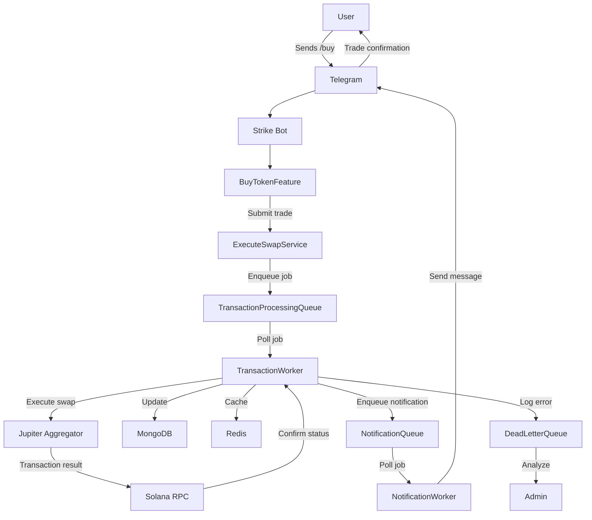

# Queue System

This document details the queue system architecture of the Strike Bot, a Telegram trading bot for the Solana blockchain. It covers the design of the transaction confirmation service, types of queues and their purposes, job processing workflow, worker configuration, error handling, and monitoring. The content is based on the `queues/` and `workers/` directories, `queues/index.ts` files in `bot/` and `server/`, and the `transaction-confirmation-service-implementation-plan.md`. A workflow diagram illustrates the queue processing system.

### Table of Contents

* Transaction Confirmation Service Design
* Queue Types and Purposes
* Job Processing Workflow and Retry Strategies
* Worker Configuration and Scaling
* Error Handling and Monitoring
* Workflow Diagram

### Transaction Confirmation Service Design

The transaction confirmation service, as outlined in `transaction-confirmation-service-implementation-plan.md`, ensures reliable processing and verification of transactions on the Solana blockchain. Key design aspects include:

* **Purpose**: Confirms transaction finality, updates database records, and notifies users of transaction outcomes.
* **Implementation**: Handled by workers in `workers/queues/transaction-processing-queue.ts`, interfacing with Solana RPC nodes via `Solana Web3.js`.
* **Components**:
  * **Queue**: `transaction-processing-queue` enqueues transaction jobs from `executeSwap.service.ts`.
  * **Worker**: Polls the queue, verifies transaction status, and updates MongoDB.
  * **Service Integration**: Interacts with `comission.service.ts` for fee calculations and `settings.service.ts` for user preferences.
* **Process**:
  1. A transaction job (e.g., buy/sell) is enqueued with details like `transactionHash`, `userId`, and `tokenAddress`.
  2. The worker queries the Solana blockchain to confirm the transaction’s status (e.g., `confirmed`, `failed`).
  3. On success, the worker updates the `Transaction` collection and caches results in Redis.
  4. The user is notified via Telegram through `buyToken.feature.ts` or `sellToken.feature.ts`.

### Queue Types and Purposes

The Strike Bot employs BullMQ for queue management, with distinct queues defined in `queues/index.ts` (both `bot/` and `server/`). The following queues are implemented:

* **Transaction Processing Queue** (`workers/queues/transaction-processing-queue.ts`):
  * **Purpose**: Handles buy/sell transactions and limit order executions.
  * **Jobs**: Execute trades via Jupiter Aggregator, confirm transactions on Solana, update MongoDB.
  * **Example**: Enqueues a `/buy` transaction with `tokenAddress`, `amount`, and `slippage`.
* **Price Monitoring Queue** (`workers/queues/price-monitoring-queue.ts`):
  * **Purpose**: Monitors token prices for limit orders and real-time updates.
  * **Jobs**: Fetches prices from DexScreener, checks limit order conditions, triggers execution if met.
  * **Example**: Polls DexScreener every 10 seconds for a token’s price.
* **Notification Queue** (`workers/queues/notification-queue.ts`):
  * **Purpose**: Sends user notifications (e.g., trade confirmations, prize pool results).
  * **Jobs**: Formats and delivers messages via Telegram’s API.
  * **Example**: Sends a “Trade completed” message after transaction confirmation.
* **Weekly Winner Queue** (`workers/queues/weekly-winner-queue.ts`):
  * **Purpose**: Processes weekly prize pool winner selection and reward distribution.
  * **Jobs**: Queries `PrizePool` collection, selects winners, updates records, notifies users.
  * **Example**: Runs weekly to award prizes based on trading volume entries.

### Job Processing Workflow and Retry Strategies

The job processing workflow ensures reliable and efficient task execution:

1. **Job Enqueueing**:
   * Services (`executeSwap.service.ts`, `comission.service.ts`) enqueue jobs via `queues/index.ts`.
   * Example: `executeSwap.service.ts` adds a trade job to `transaction-processing-queue` with `jobId`, `userId`, and transaction details.
2. **Job Processing**:
   * Workers (`workers/queues/*.ts`) poll their respective queues using BullMQ.
   * Workers execute tasks, interacting with external APIs (e.g., Jupiter Aggregator, DexScreener) or databases.
   * Results are stored in MongoDB and cached in Redis.
3. **Retry Strategies**:
   *   Configured in `queues/index.ts`:

       ```typescript
       const queueConfig = {
         connection: {
           host: process.env.REDIS_HOST || 'localhost',
           port: parseInt(process.env.REDIS_PORT || '6379'),
         },
         defaultJobOptions: {
           attempts: 5,
           backoff: {
             type: 'fixed',
             delay: 60000, // 60 seconds
           },
         },
       }
       ```
   * Jobs failing due to transient errors (e.g., RPC timeouts) are retried up to 5 times with a 60-second delay.
   * Failed jobs are moved to a dead-letter queue for analysis (`workers/queues/dead-letter-queue.ts`).
4. **Completion**:
   * Successful jobs trigger updates in MongoDB (e.g., `Transaction.status = 'completed'`).
   * Notifications are enqueued in the `notification-queue` for user feedback.

### Worker Configuration and Scaling

Workers are configured to handle high throughput and scale with demand:

* **Configuration** (`queues/index.ts`):
  *   Each queue is initialized with a Redis connection:

      ```typescript
      import { Queue } from 'bullmq';
      const transactionQueue = new Queue('transaction-processing', queueConfig);
      const priceMonitoringQueue = new Queue('price-monitoring', queueConfig);
      const notificationQueue = new Queue('notification', queueConfig);
      const weeklyWinnerQueue = new Queue('weekly-winner', queueConfig);
      ```
  *   Workers are defined in `workers/queues/*.ts` with specific concurrency settings:

      ```typescript
      import { Worker } from 'bullmq';
      const transactionWorker = new Worker('transaction-processing', processTransactionJob, {
        connection: queueConfig.connection,
        concurrency: 10, // Process 10 jobs concurrently
      });
      ```
* **Scaling Approach**:
  * **Horizontal Scaling**: Multiple worker instances are deployed using PM2 or Docker, each polling the same Redis queue.
  * **Concurrency**: Transaction workers handle up to 10 jobs simultaneously, while price monitoring workers use lower concurrency (e.g., 2) for frequent polling.
  * **Load Balancing**: BullMQ distributes jobs across workers, ensuring even load.
  * **Environment Variables**:
    * `REDIS_HOST`, `REDIS_PORT`: Configure Redis connection.
    * `WORKER_CONCURRENCY`: Adjust concurrency per worker (default: 10 for transactions).
* **Deployment** (`ecosystem.config.js`):
  *   Workers run as separate processes:

      ```javascript
      module.exports = {
        apps: [
          {
            name: 'transaction-worker',
            script: 'dist/workers/queues/transaction-processing-queue.js',
            instances: 2, // Run 2 worker instances
          },
          {
            name: 'price-monitoring-worker',
            script: 'dist/workers/queues/price-monitoring-queue.js',
            instances: 1,
          },
        ],
      }
      ```

### Error Handling and Monitoring

The queue system includes robust error handling and monitoring to ensure reliability:

* **Error Handling**:
  * **Transient Errors**: Retried automatically (up to 5 attempts) with exponential backoff.
  * **Permanent Errors**: Logged to `logs/error.log` and moved to the dead-letter queue.
  *   **Worker Error Handlers**:

      ```typescript
      transactionWorker.on('failed', (job, err) => {
        console.error(`Job ${job.id} failed: ${err.message}`);
        // Notify admin via Telegram or log to monitoring system
      });
      ```
  * Services (`executeSwap.service.ts`) handle errors gracefully, notifying users of failures via `notification-queue`.
* **Monitoring**:
  * **PM2 Logs**: `pnpm pm2 logs` displays worker activity and errors.
  * **BullMQ Metrics**: Track job completion rates, failures, and queue lengths.
  * **Health Checks**: Exposed via `server/routes/health-checks.md` to monitor queue status.
  * **Redis Monitoring**: `redis-cli monitor` tracks queue operations.
  * **Custom Metrics**: Transaction volume and prize pool entries are logged in MongoDB for analysis.

### Workflow Diagram

The following Mermaid diagram illustrates the queue processing workflow for a transaction job, from enqueueing to user notification:



#### Diagram Explanation

* **User Interaction**: The user sends `/buy`, processed by `BuyTokenFeature`.
* **Job Enqueueing**: `ExecuteSwapService` enqueues the trade in `TransactionProcessingQueue`.
* **Worker Processing**: `TransactionWorker` executes the trade via Jupiter Aggregator, confirms with Solana RPC, and updates MongoDB/Redis.
* **Notification**: A notification job is enqueued in `NotificationQueue`, processed by `NotificationWorker`, and sent to the user via Telegram.
* **Error Handling**: Failed jobs are logged and moved to `DeadLetterQueue` for admin review.
