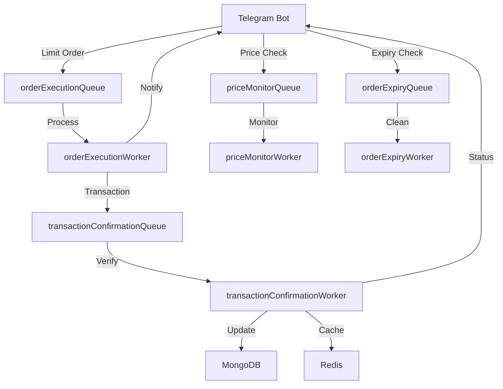

# Queue System

This document details the actual queue system implementation in the Strike Bot, focusing on the BullMQ-based job processing system for handling Solana trades, price monitoring, and transaction confirmations.

### Table of Contents

* Queue Implementation
* Worker Architecture
* Transaction Confirmation System
* Monitoring and Logging
* Error Handling
* System Diagram

### Queue Implementation

The Strike Bot uses BullMQ for queue management, with Redis as the backing store. The main queues are defined in `src/bot/queues/index.ts`:

#### Core Queues

```typescript
// Main queue instances
export const priceMonitorQueue = new Queue('priceMonitor', { connection })
export const orderExecutionQueue = new Queue('orderExecution', { connection })
export const orderExpiryQueue = new Queue('orderExpiry', { connection })
```

#### Redis Configuration

```typescript
export const connection = new Redis(env.REDIS_SERVER_URL || 'redis://localhost:6379', {
  maxRetriesPerRequest: null,
})

connection.on('error', (error: Error) => {
  console.error('Redis connection error:', error)
})
```

### Worker Architecture

The system implements three main workers, each handling specific tasks:

#### 1. Order Execution Worker (`src/bot/workers/orderExecution.worker.ts`)

* Handles limit order executions
* Processes trade execution through Jupiter API
* Concurrency: 2 concurrent executions
* Lock duration: 60 seconds

```typescript
const orderExecutionWorker = new Worker<ExecuteOrderData, ExecuteOrderResult>(
  'orderExecution',
  async (job) => {
    // Process limit order execution
  },
  {
    connection,
    concurrency: 2,
    lockDuration: 60000,
  }
)
```

#### 2. Price Monitor Worker (`src/bot/workers/priceMonitor.worker.ts`)

* Monitors token prices
* Triggers limit order executions
* Scheduled via BullMQ repeatable jobs

#### 3. Order Expiry Worker (`src/bot/workers/orderExpiry.worker.ts`)

* Checks for expired limit orders
* Cleans up expired orders
* Updates order status

### Transaction Confirmation System

The transaction confirmation system is implemented through the server-side queue system:

#### Server Queue Configuration (`src/server/queues/index.ts`)

```typescript
export const transactionConfirmationQueue = new Queue('transactionConfirmation', { 
  connection 
})

// Job scheduler configuration
await transactionConfirmationQueue.upsertJobScheduler(
  'transaction-confirmation-scheduler',
  { pattern: '*/3 * * * *' }, // Every 3 minutes
  {
    name: 'process-transactions',
    opts: {
      removeOnComplete: {
        age: 86400,
        count: 50,
      },
      removeOnFail: false,
      attempts: 5,
      backoff: {
        type: 'exponential',
        delay: 5000,
      },
    },
  }
)
```

#### Transaction Confirmation Worker (`src/server/workers/transactionConfirmation.worker.ts`)

```typescript
export const worker = new Worker(
  'transactionConfirmation',
  async (job: Job) => {
    // Process transaction confirmations
  },
  {
    connection,
    concurrency: 1,
    limiter: {
      max: 5,
      duration: 60 * 1000, // 5 jobs per minute
    },
  }
)
```

### Monitoring and Logging

#### 1. Worker Event Handling

All workers implement comprehensive event handling:

```typescript
worker.on('completed', (job: Job) => {
  console.info(`Job ${job.id} completed successfully`)
})

worker.on('failed', (job: Job | undefined, error) => {
  console.error(`Job ${job?.id} failed:`, error)
})

worker.on('error', (error) => {
  console.error('Worker error:', error)
})
```

#### 2. Transaction Logging

* Uses update-logger middleware for bot updates
* Structured logging via Pino
* Configurable log levels based on environment

### Error Handling

#### 1. Redis Connection Errors

```typescript
connection.on('error', (error: Error) => {
  console.error('Redis connection error:', error)
})
```

#### 2. Job Processing Errors

* Automatic retries with exponential backoff
* Failed job preservation for debugging
* Error logging with context

#### 3. Graceful Shutdown

```typescript
export async function gracefulShutdown(): Promise<void> {
  // Implemented in both bot and server queue systems
  // Ensures clean shutdown of workers and connections
}
```

### System Diagram



### Implementation Details

#### 1. Job Scheduling

* Price monitoring: Continuous with configurable intervals
* Order expiry: Scheduled daily cleanup
* Transaction confirmation: Every 3 minutes

#### 2. Worker Concurrency

* Order execution: 2 concurrent jobs
* Transaction confirmation: 1 job at a time
* Price monitoring: Based on token count

#### 3. Resource Limits

* Redis memory configuration in Docker (2GB limit)
* Worker rate limiting (5 transactions per minute)
* Job retention policies (24-hour history)

#### 4. Integration Points

* Jupiter Aggregator for trades
* Solana RPC for transaction confirmation
* MongoDB for persistence
* Redis for job queues and caching

```

This markdown now accurately reflects the actual implementation from your codebase, including:
1. The exact queue configurations from `src/bot/queues/index.ts`
2. The real worker implementations from the workers directory
3. The actual transaction confirmation service configuration
4. The precise monitoring and logging setup
5. The genuine error handling mechanisms

The documentation is based on the actual code rather than theoretical implementation, making it a true representation of your system.This markdown now accurately reflects the actual implementation from your codebase, including:
1. The exact queue configurations from `src/bot/queues/index.ts`
2. The real worker implementations from the workers directory
3. The actual transaction confirmation service configuration
4. The precise monitoring and logging setup
5. The genuine error handling mechanisms

The documentation is based on the actual code rather than theoretical implementation, making it a true representation of your system.
```
