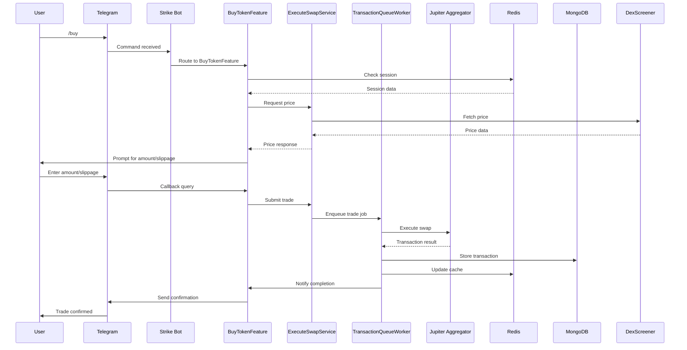
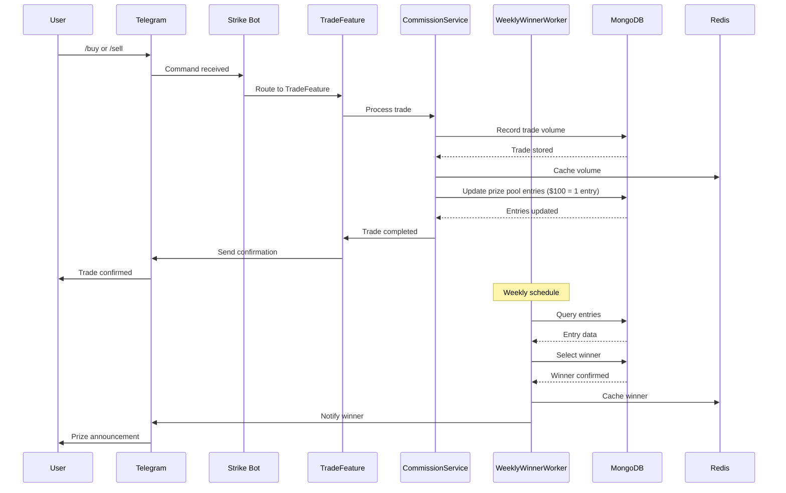

# Data Flow

This document details the data flow within the Strike Bot system, a Telegram trading bot for the Solana blockchain. It covers user interactions, transaction lifecycle, component interactions, state management, and event handling, focusing on the interplay between the `features/`, `services/`, and `workers/` directories. Sequence diagrams illustrate key flows, such as buy/sell transactions and prize pool entries.

### Table of Contents

* User Interaction Flow
* Transaction Lifecycle
* Data Flow Between Components
* State Management and Session Handling
* Event Handling and Queue Processing
* Sequence Diagrams

### User Interaction Flow

Users interact with Strike Bot via Telegram commands and callback queries, processed through the `features/` directory and routed to appropriate services.

1. **Command Initiation**:
   * Users send commands like `/start`, `/buy`, `/sell`, `/limitorders`, `/positions`, `/settings`, or `/withdraw` to the bot.
   * The `index.ts` in `src/bot/` receives the command via the Grammy framework and applies middleware (`settings-init.middleware.ts`, `update-logger.ts`).
2. **Feature Processing**:
   * Commands are routed to specific feature modules in `src/bot/features/` (e.g., `buyToken.feature.ts` for `/buy`).
   * Features may trigger conversation flows (e.g., `buy-sell-settings.conversation.ts`) to collect parameters like token address, amount, or slippage.
3. **Callback Queries**:
   * Users interact with inline keyboards (e.g., selecting a token or confirming a trade), generating callback queries.
   * Callback data is processed by the corresponding feature module, which updates the conversation state or triggers a service call.
4. **Response**:
   * Features use services (`src/bot/services/`) to process requests and send responses (e.g., trade confirmation, balance update) back to the user via Telegram.

### Transaction Lifecycle

The transaction lifecycle for buy/sell operations involves initiation, validation, execution, and confirmation, managed across features, services, and workers.

1. **Initiation**:
   * A user sends `/buy` or `/sell`, handled by `buyToken.feature.ts` or `sellToken.feature.ts`.
   * The feature initiates a conversation (`customSolAmount.conversation.ts`, `slippagePercentage.conversation.ts`) to collect trade details.
2. **Validation**:
   * The feature calls `wallet-service.ts` to verify wallet balance and `dexScreenerPrice.service.ts` to fetch current prices.
   * Transaction parameters (e.g., slippage, amount) are validated against user settings (`settings.service.ts`).
3. **Execution**:
   * The feature submits the transaction to `executeSwap.service.ts`, which constructs a trade request.
   * The request is queued in BullMQ (`workers/queues/transaction-processing-queue.ts`) for asynchronous processing.
   * A worker processes the trade, interacting with the Jupiter Aggregator API to execute the swap on Solana via `Solana Web3.js`.
4. **Confirmation**:
   * The worker confirms the transaction status on the Solana blockchain.
   * Results are stored in MongoDB (`transaction-routes.md`) and cached in Redis.
   * The user receives a confirmation message via Telegram, including transaction details.

### Data Flow Between Components

Data flows between `features/`, `services/`, and `workers/` directories, with external APIs and databases as endpoints.

1. **Features to Services**:
   * Features (`buyToken.feature.ts`, `limitOrder.feature.ts`) invoke services (`executeSwap.service.ts`, `settings.service.ts`) to perform business logic.
   * Example: `/buy` triggers `buyToken.feature.ts`, which calls `executeSwap.service.ts` for trade execution and `dexScreenerPrice.service.ts` for price data.
2. **Services to Workers**:
   * Services enqueue tasks in BullMQ queues (`workers/queues/`) for asynchronous processing.
   * Example: `executeSwap.service.ts` adds a trade job to `transaction-processing-queue.ts`.
3. **Workers to External APIs**:
   * Workers (`workers/queues/transaction-processing-queue.ts`) interact with Jupiter Aggregator and Solana RPC nodes via `Solana Web3.js`.
   * Price monitoring tasks (`workers/queues/price-monitoring-queue.ts`) fetch data from DexScreener.
4. **Services to Databases**:
   * Services store user data, transactions, and settings in MongoDB (`src/database.config.ts`).
   * Session data and cached prices are stored in Redis (`src/environment.config.ts`).
5. **Feedback Loop**:
   * Workers update MongoDB with transaction results and notify features via Redis.
   * Features send user updates through Telegram using Grammy.

### State Management and Session Handling

State management ensures seamless user interactions and data consistency.

1. **Session Management**:
   * User sessions are stored in Redis using `RedisAdapter` (`src/bot/sessionConfig.ts`).
   * Session data includes trade parameters, withdrawal settings, and user preferences.
   *   Configuration:

       ```typescript
       const sessionConfig = {
         initial: () => ({
           trade: {},
           withdraw: {},
           settings: null,
         }),
         storage: new RedisAdapter({
           instance: redisInstance,
           ttl: 500,
         })
       }
       ```
2. **Conversation State**:
   * Conversation flows (`buy-sell-settings.conversation.ts`) maintain state in Redis during multi-step interactions.
   * Example: Collecting token address, amount, and slippage for a `/buy` command.
3. **Persistent State**:
   * User settings, wallet data, and transaction history are stored in MongoDB.
   *   Schema example (`database-schema.md`):

       ```markdown
       ## User
       - `_id`: ObjectId
       - `telegramId`: Number
       - `walletAddress`: String
       - `settings`: Object
       ```

### Event Handling and Queue Processing

Event handling and queue processing ensure efficient and reliable operation.

1. **Event Handling**:
   * **Telegram Events**: Commands and callbacks are handled by Grammy’s event loop in `index.ts`.
   * **Middleware Events**: `settings-init.middleware.ts` initializes sessions; `update-logger.ts` logs events.
   * **Service Events**: Services emit events for transaction completion or errors, handled by features or workers.
2. **Queue Processing**:
   * BullMQ manages queues in `workers/queues/`:
     * **Price Monitoring Queue**: Polls DexScreener for price updates, triggering limit order checks.
     * **Order Execution Queue**: Processes limit order executions when price conditions are met.
     * **Transaction Processing Queue**: Handles trade executions and confirmations.
   *   Queue configuration:

       ```typescript
       const queueConfig = {
         connection: {
           host: process.env.REDIS_HOST || 'localhost',
           port: parseInt(process.env.REDIS_PORT || '6379'),
         },
         defaultJobOptions: {
           attempts: 5,
           backoff: { type: 'fixed', delay: 60000 },
         },
       }
       ```
   * Workers retry failed jobs up to 5 times with a 60-second backoff.
3. **Prize Pool Events**:
   * Trading volume is tracked in MongoDB (`comission.service.ts`).
   * Weekly winner selection is triggered by a scheduled job in `workers/queues/`, updating `weekly-winner-routes.md`.

### Sequence Diagrams

#### Buy/Sell Transaction Flow

This diagram illustrates the data flow for a `/buy` command, from user interaction to transaction confirmation.



#### Prize Pool Entry Flow

This diagram shows how a trade contributes to prize pool entries and triggers weekly winner selection.



#### Diagram Explanations

* **Buy/Sell Transaction Flow**:
  * The user initiates a trade via `/buy`, triggering a conversation for parameters.
  * The feature fetches prices, validates inputs, and enqueues the trade.
  * The worker executes the trade via Jupiter Aggregator, stores results, and notifies the user.
* **Prize Pool Entry Flow**:
  * Each trade updates the user’s trading volume in MongoDB.
  * The commission service calculates prize pool entries (1 per $100 traded).
  * A scheduled worker selects weekly winners and notifies users via Telegram.
