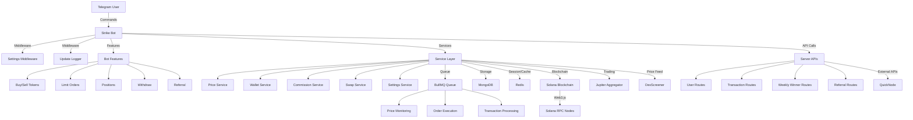

# System Design

This document outlines the system design of Strike Bot, a Telegram trading bot for the Solana blockchain. It details the high-level architecture, core components, integration points, key modules, system requirements, and includes a component diagram illustrating the interactions between different parts of the system.

### Table of Contents

* High-Level Architecture
* Core Components
* Integration Points
* Key Modules
* System Requirements and Dependencies
* Component Diagram

### High-Level Architecture

Strike Bot is designed as a modular, service-oriented Telegram bot leveraging a middleware-based architecture for processing user interactions. It integrates with the Solana blockchain for trading operations and uses external APIs for price feeds and transaction routing. The system employs MongoDB for persistent storage, Redis for session management and caching, and BullMQ for asynchronous task queues. Key architectural decisions include:

* **Modular Design**: Separates bot features, services, and server APIs for maintainability and scalability.
* **Asynchronous Processing**: Uses queues to handle high-volume transactions and price monitoring tasks.
* **Secure Integration**: Employs encrypted wallet management and transaction validation for user safety.
* **Scalable Infrastructure**: Utilizes Docker and PM2 for deployment and process management.

The system is structured into three primary layers:

1. **Bot Layer** (`src/bot/`): Handles Telegram interactions, user commands, and conversation flows.
2. **Service Layer** (`src/bot/services/`): Encapsulates business logic for trading, wallet management, and rewards.
3. **Server Layer** (`server/`): Provides APIs for internal and external interactions, managing data flow and integrations.

### Core Components

#### Bot Features (`src/bot/features/`)

The bot supports a range of user-facing features implemented as modular components:

* **`buyToken.feature.ts`**: Executes token purchases with customizable slippage and amount settings.
* **`sellToken.feature.ts`**: Facilitates token sales with validation and balance checks.
* **`trade.feature.ts`**: Provides the core trading interface for market and limit orders.
* **`positions.feature.ts`**: Manages user positions, including profit/loss tracking.
* **`limitOrder.feature.ts`**: Implements limit order creation, monitoring, and execution.
* **`settings.feature.ts`**: Allows users to configure trading preferences.
* **`withdraw.feature.ts`**: Handles secure fund withdrawals.
* **`referral-feature.ts`**: Manages referral tracking and commission distribution.

#### Server APIs (`server/`)

The server layer exposes APIs for internal operations and external integrations:

* **User Routes** (`server/routes/user-routes.md`): Manage user data, such as wallet addresses and settings.
* **Transaction Routes** (`server/routes/transaction-routes.md`): Handle trade execution and history.
* **Weekly Winner Routes** (`server/routes/weekly-winner-routes.md`): Process prize pool winners.
* **Referral Routes** (`server/routes/referral-routes.md`): Track referrals and commissions.
* **Controllers** (`server/controllers/`): Implement API logic, interfacing with services and databases.

#### Services (`src/bot/services/`)

Services encapsulate the business logic and interact with external systems:

* **`dexScreenerPrice.service.ts`**: Fetches real-time token prices from DexScreener.
* **`executeSwap.service.ts`**: Executes trades via Jupiter Aggregator, handling slippage and fees.
* **`comission.service.ts`**: Calculates and distributes referral and platform fees.
* **`settings.service.ts`**: Manages user preferences, stored in MongoDB.
* **`wallet-service.ts`**: Handles wallet operations, including key encryption and transaction signing.
* **`hidden-tokens-service.ts`**: Manages token visibility for user interfaces.

### Integration Points

Strike Bot integrates with the Solana blockchain and external services to enable trading and reward systems:

* **Solana Blockchain**:
  * **Solana Web3.js**: Facilitates blockchain interactions, such as transaction signing and balance queries.
  * **Jupiter Aggregator API**: Optimizes trade routes and liquidity for token swaps.
  * **Solana RPC Nodes**: Provide blockchain data and transaction submission endpoints.
* **External Services**:
  * **DexScreener Price Feed**: Supplies real-time token prices for trading and limit order monitoring.
  * **QuickNode APIs**: Enhance blockchain access with high-performance RPC endpoints.
* **Databases**:
  * **MongoDB**: Stores user profiles, transaction history, and settings.
  * **Redis**: Manages sessions, caching, and queue operations via BullMQ.

### Key Modules

#### Transaction Handling

* **Implementation**: `executeSwap.service.ts`, `transaction-routes.md`, `transaction-controllers.md`
* **Functionality**:
  * Validates transactions for sufficient balance and slippage tolerance.
  * Uses Jupiter Aggregator for optimal trade execution.
  * Processes transactions asynchronously via BullMQ queues.
  * Logs transaction history in MongoDB.
* **Safety Features**:
  * Slippage protection to minimize trade losses.
  * Error handling for failed transactions.
  * Rate limiting to prevent abuse.

#### Wallet Management

* **Implementation**: `walletService.helper.ts`, `wallet-service.ts`
* **Functionality**:
  * Generates and encrypts private keys for user wallets.
  * Signs transactions securely using Solana Web3.js.
  * Tracks wallet balances and updates via MongoDB.
  * Supports secure withdrawals with validation checks.
* **Security**:
  * AES encryption for private keys (configured via `IV_KEY` and `ENCRYPTION_KEY`).
  * Session-based authentication using Redis.

#### Prize Pool System

* **Implementation**: `comission.service.ts`, `weekly-winner-routes.md`, `weekly-winner-controllers.md`
* **Functionality**:
  * Awards 1 prize pool entry per $100 traded, tracked in MongoDB.
  * Runs weekly draws to select winners, managed via server APIs.
  * Distributes rewards to winners’ wallets on Solana.
* **Referral Integration**:
  * Allocates 50% commission to direct referrers and 10% to indirect referrers.
  * Tracks referral activity and commissions in MongoDB.

### System Requirements and Dependencies

#### System Requirements

* **Node.js**: Version 20.18.3 or higher
* **npm**: Version 10.8.2 or higher
* **pnpm**: Version 9.10.0 or higher
* **Redis Server**: For session management and task queues
* **MongoDB Database**: For persistent storage
* **Operating System**: Linux (Ubuntu recommended), macOS, or Windows with WSL
* **Network**: Stable internet for blockchain and API interactions

#### Dependencies

* **Core Libraries**:
  * `typescript`: Type-safe JavaScript development
  * `@grammyjs/grammy`: Telegram bot framework
  * `mongodb`: MongoDB driver for Node.js
  * `redis`: Redis client for session and queue management
  * `bullmq`: Queue management for asynchronous tasks
* **Blockchain Libraries**:
  * `@solana/web3.js`: Solana blockchain interactions
  * Jupiter Aggregator SDK: Trade optimization
* **Development Tools**:
  * `eslint`: Code quality and linting
  * `docker`: Containerization
  * `pm2`: Process management
* **Environment Variables** (from `.env`):
  * `BOT_TOKEN`: Telegram bot token
  * `MONGO_URI`: MongoDB connection string
  * `REDIS_SERVER_URL`: Redis connection URL
  * `QUICKNODE_API_KEY`: QuickNode API access
  * `IV_KEY`, `ENCRYPTION_KEY`: Encryption settings
  * `PLATFORM_FEE_WALLET_ADDRESS`, `PLATFORM_FEE_PERCENTAGE`: Fee configuration

### Component Diagram

The following Mermaid diagram illustrates the interactions between the bot, services, server, databases, and external systems:

#### Diagram Explanation

* **Telegram User**: Interacts with the bot via commands like `/start`, `/buy`, or `/withdraw`.
* **Strike Bot**: Processes commands through middleware (`settings-init`, `update-logger`) and routes them to features or services.
* **Bot Features**: Handle specific user interactions (e.g., trading, withdrawals) and rely on the service layer.
* **Service Layer**: Executes business logic, interacting with queues, databases, and external systems.
* **BullMQ Queue**: Manages asynchronous tasks like price monitoring and transaction processing.
* **Server APIs**: Provide endpoints for user management, transactions, and prize pool operations.
* **Databases**: MongoDB stores persistent data; Redis handles sessions and caching.
* **External Systems**: Solana blockchain (via Web3.js and QuickNode), Jupiter Aggregator for trades, and DexScreener for prices.
